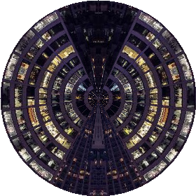

# yytwirl 🌀



Take a flat strip of pixels, grab one edge, and *twirl* it into a disc. That's the whole idea. These are little [p5.js](https://p5js.org/) sketches for playing with the math that wraps a **rectangle** (or a **triangle**) onto a **circle** — and unwraps it back again.

Think of it like rolling up a poster into a tube and looking down the end, except the poster is also allowed to taper to a single point in the middle. Spooky.

## The two toys

### 🎯 `yytwirl-mapping.html` — the math tester
The honest, no-frills sandbox for checking that the formulas actually do what you think.

- A **rectangle** up top, a **circle** down below.
- **Click anywhere** in either shape and watch where that point lands in the other one, connected by a little gray string.
- Toggle between **rectangle** and **triangle** mappings.
- Every click spills the angle/distance math into the console, because trust is earned.

Use this when a mapping looks wrong and you need to know *why*.

### 🖼️ `yytwirl-draw.html` — the pretty one
Same math, but applied to **whole images** instead of lonely points.

- Drag the four numbered **handles** to reshape the source quad.
- Or hit **random image** to pull a fresh photo from [picsum.photos](https://picsum.photos/) and watch it get wrung out into a circle.
- Switch between **rectangle** and **triangle** mappings to change the flavor of the swirl.

Use this when you want to *see* the twirl, not just believe in it.

## The mappings, briefly

| Mapping | x becomes… | y becomes… | vibe |
|---|---|---|---|
| **rectangle** | the angle around the circle | radial distance from the edge | a clean ring |
| **triangle** | the angle | radial distance | a swirl that collapses to a point in the center (there's a singularity at the tip — handle with care) |

The four functions doing the work — `mapRect2Circ`, `mapTri2Circ`, `mapCirc2Rect`, `mapCirc2Tri` — live in both files and are the actual stars of the show.

## Running it

No build, no install, no `npm` ritual. p5.js loads from a CDN, so just:

1. Open either `.html` file in a browser, **or**
2. Serve the folder if your browser is fussy about the random-image fetch:
   ```sh
   python3 -m http.server
   ```
   then visit <http://localhost:8000>.

Now go twirl something.
